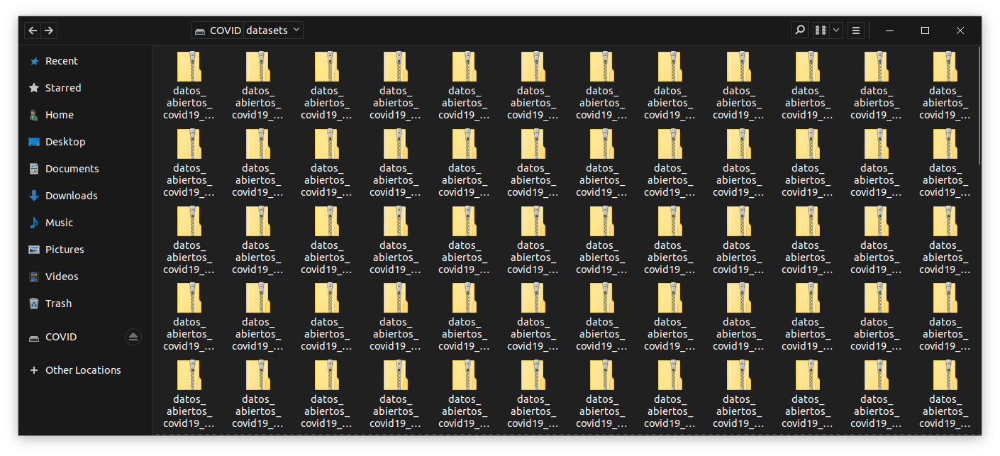

# DescargaDatosAbiertosCovid

## Actualización 28-Abril-2022

> El día de ayer dejaron de actualizar las bases de datos de COVID-19. Para evitar que eventualmente quiten los vínculos a las bases éstas se encuentran ya publicadas con el siguiente DOI [10.17605/OSF.IO/9NU2D](https://osf.io/9nu2d/)

## Objetivo 



Utiliza `DescargaHistoricos.py` para descargar todas las bases de datos históricas de la Dirección General de Epidemiología sobre COVID-19 y almacenarlas localmente.

## Automatización para descarga diaria

En Linux, genera un `crontab`. Para ello instala `crontab` y luego edita con

```bash
crontab -e
```

el documento queda como:

```bash
0 4 * * * /path/a/python3 /path/a/DescargaHistoricos.py > /dev/null 2>&1
```

para actualización diaria a las 4am. 

## En desarrollo

+ Formateo de las bases en SQL o MariaDB para su lectura.
+ Modelos de nowcasting. 